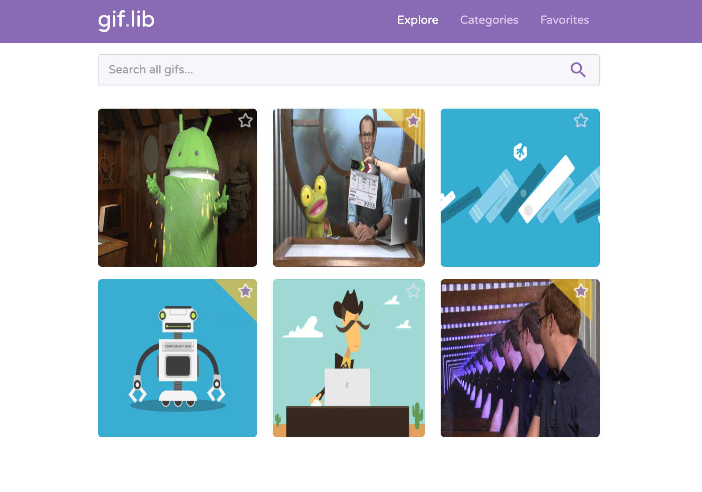
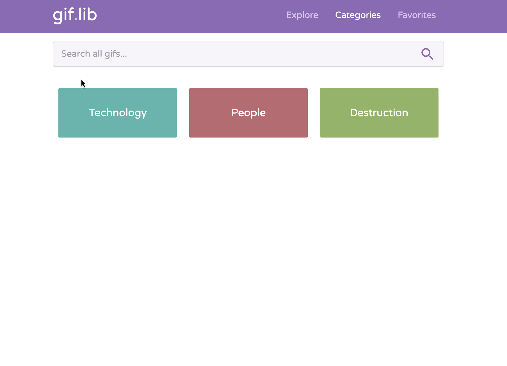
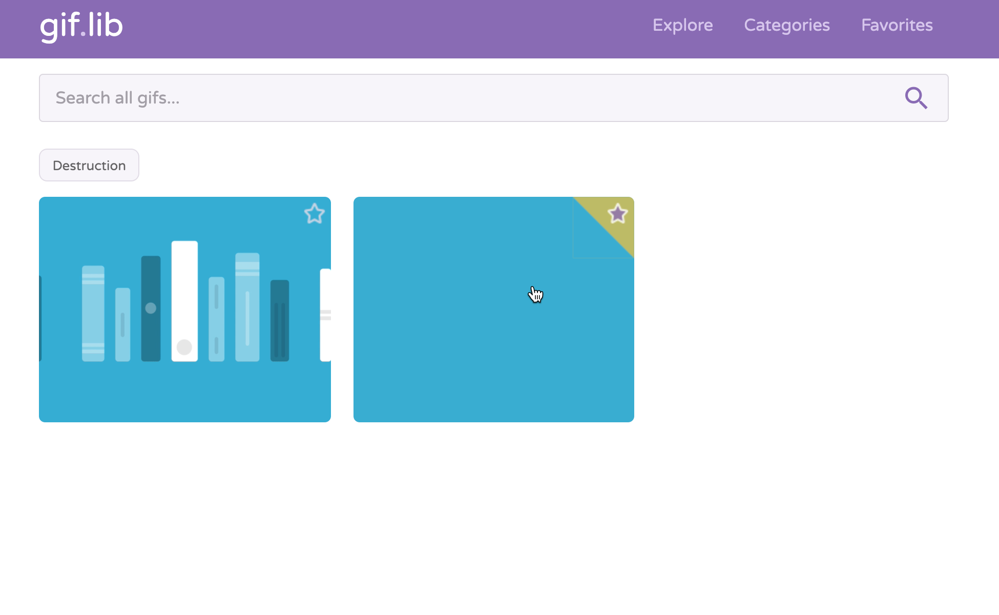

# giflab 

Java Web Application built using the Spring Boot Web Framework, to demonstrate it's functionality.

App Preview **[here]()**

### Technology
* **Programming Language - [Java](https://go.java/?intcmp=gojava-banner-java-com)**
  > Java is a general-purpose programming language that is class-based, object-oriented, and designed to have as few implementation dependencies as possible. 
* **Framework - [Spring Boot](https://spring.io/projects/spring-boot)**
  > Spring Boot is an open source Java-based framework used to create a micro Service. It is developed by Pivotal Team and is used
* **Build Automation Tool - [Gradle Build Tool](https://gradle.org/)**
  > Gradle is an open-source build automation system that builds upon the concepts of Apache Ant and Apache Maven and introduces a Groovy-based domain-specific language instead of the XML form used by Apache Maven for declaring the project configuration.
* **Templating Engine - [Thymeleaf](https://www.thymeleaf.org/)**
  > Thymeleaf is a modern server-side Java template engine for both web and standalone environments.
* **Integrated Development Environment (IDE) - [IntelliJ IDEA](https://go.java/?intcmp=gojava-banner-java-com)**
  > IntelliJ IDEA is an integrated development environment written in Java for developing computer software.
* **Deployment Platform - [Heroku](https://www.heroku.com/)**
  > Heroku is a cloud platform as a service supporting several programming languages. 
* **CSS Framework - [Materialize CSS](https://materializecss.com/)**
  > A modern responsive front-end framework based on Material Design
* **JavaScript Library - [jQuery](https://jquery.com/)**
  > jQuery is a JavaScript library designed to simplify HTML DOM tree traversal and manipulation, as well as event handling, CSS animation, and Ajax. 
  
### Screenshots
  

  

